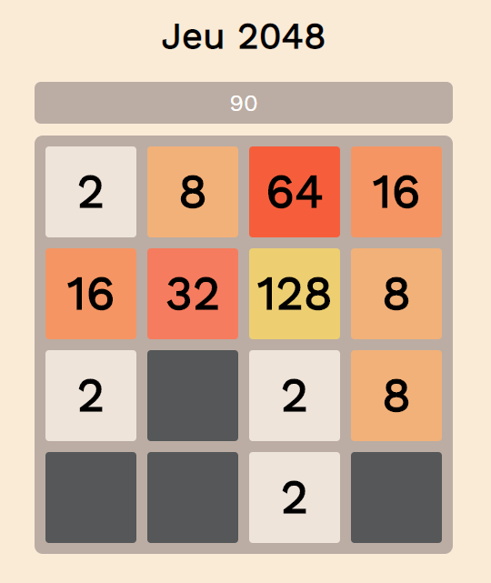
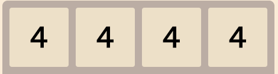
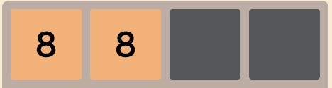
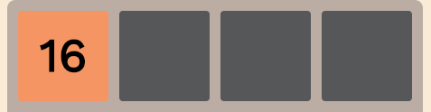
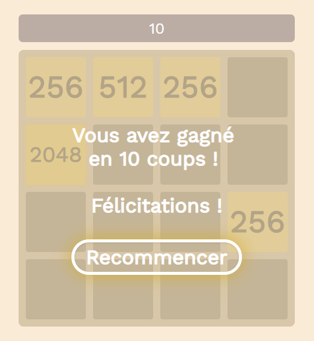
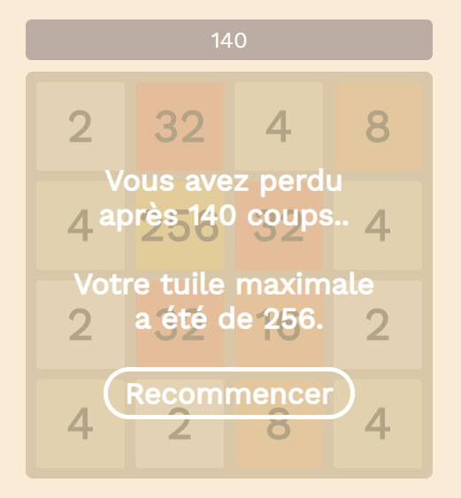

Rapport TP2 - 2048 - Technologie de l'Internet
=======================================

    
**Nom:** Jonathan Caspar
    
**Matricule:** 20059041

**Courriel:** jonathan.caspar@umontreal.ca

Choix de représentation :
------------------------------------------------------------------------

La présentation du jeu est largement inspirée du jeu officiel
[2048](http://gabrielecirulli.github.io/2048/) de Gabriele Cirulli
notamment pour les couleurs utilisées.

J'ai fait le choix d'afficher la grille de jeu dans un élement
**table** avec une largeur/hauteur de cases fixée à **100px**.

Le pattern qui définit le nombre de lignes/colonnes de **table**
est défini en Javascript (Game.js) en fonction de la taille de grille
fourni en paramètres lors de l'instanciation de **Game**.

La valeur des tuiles est représentée au travers des classes auxquelles
elles sont associées pour facilement adapter l'affichage des tuiles en
CSS. Toutes les tuiles sont de classe CSS **tile**. Si elles
n'appartiennent à aucune autre classe CSS, elles sont considérées comme
**vides**.\
Auquel cas, elles sont aussi de classes CSS **tile-X** (avec
**X** = la valeur de la tuile).

De plus, la **vue** a été séparée du **modèle** : le script
Javascript (Game.js) utilise une représentation interne sous forme de
tableau bi-dimensionnel (contenant des objets Tile) pour calculer et
stocker les données liées aux tuiles.

Un objet Tile possède notamment un attribut **merged** qui définit
si celui ci a récemment été créée à la suite d'une fusion entre deux
autres Tile.

Cela permet ainsi d'éviter d'agréger toutes les tuiles de valeur
similaire d'un seul coup et de restreindre la fusion de tuiles (au cours
d'un mouvement) aux tuiles qui n'ont pas encore été fusionnées.

Par exemple, un mouvement vers la gauche de  doit
donner  et
non .

Lorsque les calculs sont terminées, on fait appel à
**updateView()** pour mettre à jour la vue (i.e.
**\#game-container**)

Lorsqu'un statut de terminaison de jeu est détecté, un message
d'information transparent vient s'apposer sur la grille de jeu afin
d'informer le joueur de son score et lui proposer de recommencer une
partie. Le déplacement des tuiles est également désactivé.

Cette boîte de message (**\#message-wrapper**) est présente dans le
fichier HTML mais reste cachée jusqu'à ce que le script Javascript la
fasse apparaître.

Lorsque le joueur réussit à former une tuile 2048 :

Lorsque le joueur ne peut plus déplacer de tuiles avant d'atteindre une
tuile 2048 :

Pour finir, ce choix de représentation de l'information en interne
(grâce à un tableau 2D) permet d'éviter aux joueurs de "tricher" en
modifiant directement le code HTML (et donc la valeur des tuiles)
puisque cela aurait été rendu possible dans le cas où la représentation
des données liées aux tuiles étaient stockées et lues directement dans
le DOM.

Ce que j'ai appris :
------------------------------------------------------------------------

-   La modification directe du contenu HTML d'un élement grâce à
    l'attribut "innerHTML"
-   Interaction avec CSS depuis JS via l'utilisation de "setAttribute"
    ou "element.style.x"
-   Passage d'éléments du DOM en paramètre (passage de "document" pour
    instancer **Game**)

Liens vers le code source :
------------------------------------------------------------------------

\
**Le jeu 2048 est disponible à cette [adresse](https://p1129743.github.io/IFT3225-2048/).**

\
Le projet est organisée de la manière suivante:

-   img/ (images du rapport)
    -   [2048-UI.png](img/2048-UI.png)
    -   [game-over-message.png](img/game-over-message.png)
    -   [win-message.png](img/win-message.png)
    -   [4tiles.png](img/4tiles.png)
    -   [8tiles.png](img/8tiles.png)
    -   [16tiles.png](img/16tiles.png)
-   js/
    -   [App.js](js/App.js) (script principal appelé au chargement du
        DOM pour instancier Game avec le paramètre "size")
    -   [Game.js](js/Game.js) (logique du jeu 2048)
    -   [Tile.js](js/Tile.js) (représentation d'une tuile)
    -   [utils.js](js/utils.js) (script avec fonctions utilitaires, dans
        mon cas, il n'y a que celle qui permet de créer un tableau
        bi-dimensionnel initialisé avec une nouvelle instance d'une
        classe d'objet passée en paramètres)
-   styles/
    -   [2048-game-style.css](styles/2048-game-style.css) (style
        d'affichage de l'application (tuiles, compteur, etc...))
-   [index.html](index.html) (la vue du jeu HTML)
-   [rapport.html](rapport.html) (le présent rapport)

